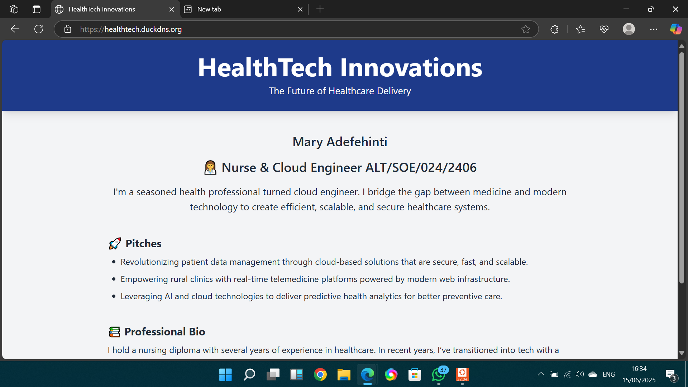

# 🚀 HealthTech Landing Page – Cloud Deployment (DigitalOcean)

This is my submission for the AltSchool Tinyuka Second Semester Cloud Engineering exam. 
It showcases a deployed landing page for a HealthTech startup on a **DigitalOcean Droplet**, with Nginx and GitHub integration.

---

### ✅ Project Information

🔗 Live IP: https://healthtech.duckdns.org/

## 📸 Screenshot


🧑‍💻 Author: Adefehinti Mary – ALT/SOE/024/2406

## 📌 Steps Completed

### 1. ✅ Created Droplet on DigitalOcean

- **Ubuntu 22.04**
- Set up using **SSH key authentication**
- Connected via terminal using:
  ```bash
  ssh root@165.232.109.97
  ```

### 2. ✅ Installed Nginx

-Updated packages:

```bash
sudo apt update
sudo apt install nginx -y
```

-Allowed traffic:

```bash
sudo ufw allow 'Nginx Full'
```

-Visited:
<<<<<<< HEAD
http to confirm Nginx is running.
=======
http://165.232.109.97 to confirm Nginx is running.
>>>>>>> 05c7e42 (Update landing page and README)

### 3. ✅ Created Landing Page

-Created HTML file at:
/var/www/healthtech/index.html
-Used Tailwind CSS via CDN for styling:
html

### 4. ✅ Node.js Setup (Optional Enhancement)
<<<<<<< HEAD
-Created a Node.js app (app.js) to serve content.
=======

Created a Node.js app (app.js) to serve content.
>>>>>>> 05c7e42 (Update landing page and README)

-Installed Node and PM2:

```bash
sudo apt install nodejs npm -y
npm install -g pm2
Started the app:
```

```bash
pm2 start app.js
```

### 5. ✅ Configured Nginx Reverse Proxy

-Edited config:
/etc/nginx/sites-available/healthtech

-Set up proxy to forward to Node.js on port 3000.

### 6. ✅ 🌐 Domain Configuration with DuckDNS

To make the deployed web application accessible using a custom domain instead of just the IP address, I used DuckDNS, a free DNS service.

Steps Taken:
-Visited duckdns.org

-Signed in using my GitHub account.

-Created a subdomain

<<<<<<< HEAD
-Selected a unique subdomain name,:
=======
-Selected a unique subdomain name, for example:
>>>>>>> 05c7e42 (Update landing page and README)
healthtech.duckdns.org

-Linked the subdomain to my Droplet's public IP address

-Entered the IP address of my DigitalOcean droplet in the DuckDNS dashboard under that subdomain.

-Configured Nginx to use the domain

<<<<<<< HEAD
Edited the Nginx configuration file:
=======
-Edited the Nginx configuration file:
>>>>>>> 05c7e42 (Update landing page and README)

```bash
sudo nano /etc/nginx/sites-available/default

```
<<<<<<< HEAD
nginx
server_name healthtech.duckdns.org;
=======

-I updated the server_name field to:
nginx server_name healthtech.duckdns.org;
>>>>>>> 05c7e42 (Update landing page and README)
-Restarted Nginx to apply changes:

```bash
sudo systemctl restart nginx
```

✅ Now I can access my website via http://healthtech.duckdns.org

### 7. ✅ GitHub Integration

Initialized Git:

```bash
git init
git remote add origin git@github.com:nikehcodes/healthtech-exam.git
git add .
git commit -m ""
git push -u origin main
SSH key added to GitHub to allow pushing via SSH.
```
